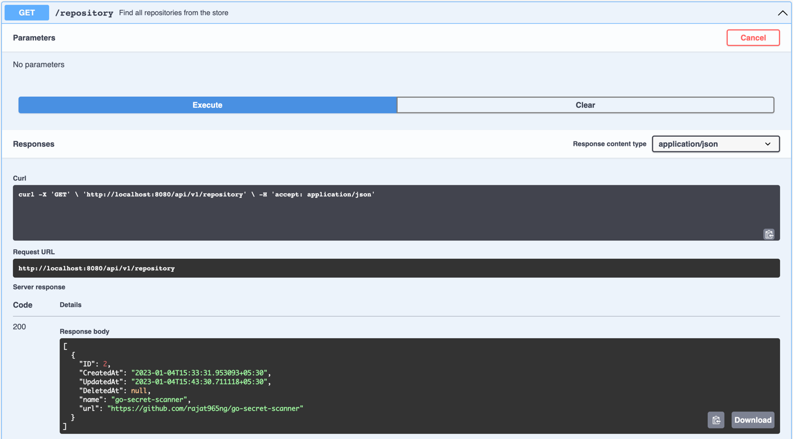
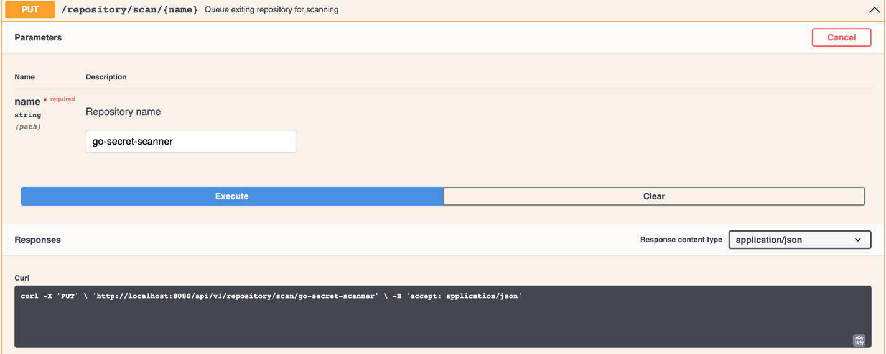
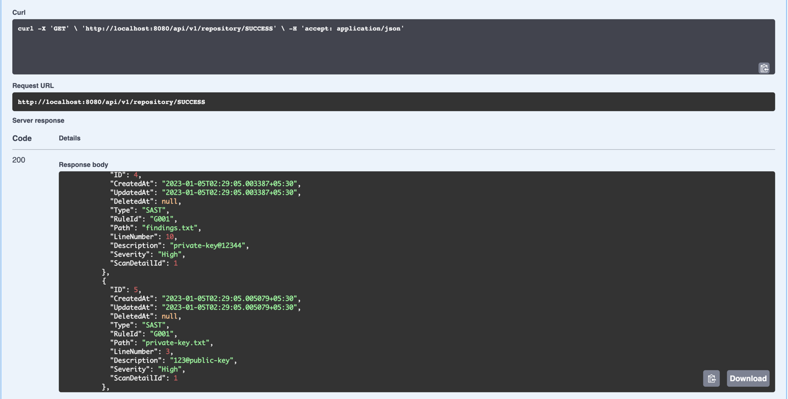

# Findit

## Description
A Simple application that dig out secrets and find out vulnerabilities in source code and its dependencies.

## Plan
### Phase 1 (In-Progress)
- Expose API documentation with simple CRUD operations to initialize the repositories and setup custom scanning rules.
- Integrate application with multiple opensource CVE repositories.
- The application must be able perform secret and CVE scanning using API specs.
- Work on UX designs. 

### Phase 2 (To-Do)
- Build frontend on top APIs.
- Optimize backend and decrease scanning time.
- Create historical layer of past vulnerability.
- Integrate SSO and OpenLDAP.

### Phase 3 
- TBD

## Guide

